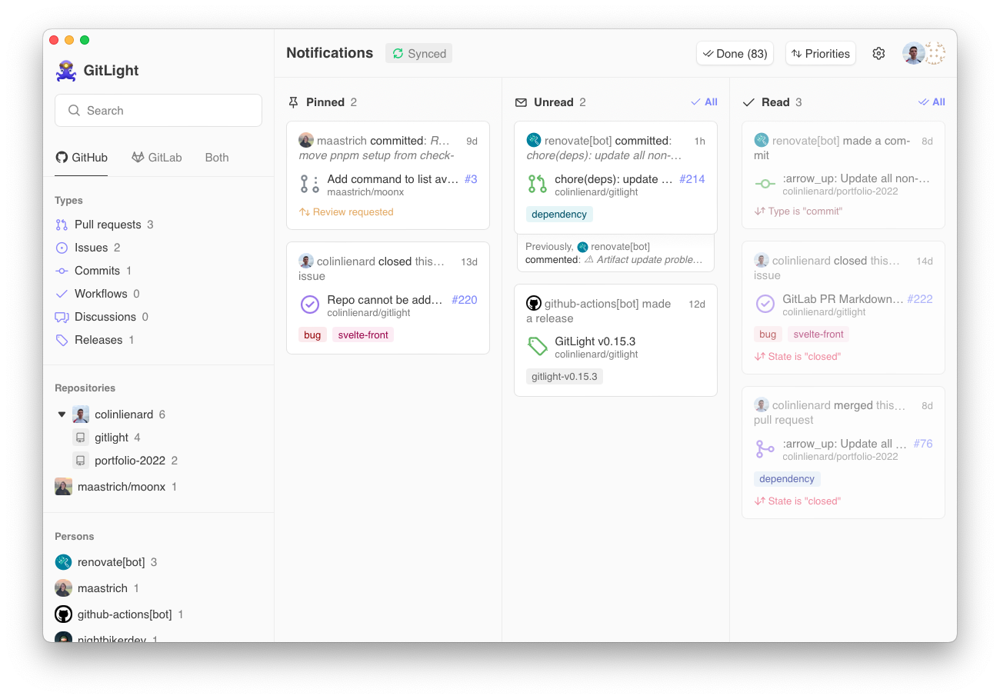

<div align="center">


# GitLight

GitHub & GitLab notifications on your desktop • [gitlight.app](https://gitlight.app)

<table>
  <tbody>
    <tr>
      <td>Download for</td>
      <td>      
        <a href="https://gitlight.app/download/windows">
           Windows
        </a>
      </td>
      <td>
        <a href="https://gitlight.app/download/apple-silicon">
          <picture>
            <source media="(prefers-color-scheme: dark)" srcset="./assets/apple-dark.png">
            
          </picture> Apple Silicon
        </a>
      </td>
      <td>
        <a href="https://gitlight.app/download/mac-intel">
          <picture>
            <source media="(prefers-color-scheme: dark)" srcset="./assets/apple-dark.png">
            
          </picture> Mac Intel
        </a>
      </td>
      <td>
        <a href="https://gitlight.app/download/linux">
           Linux
        </a>
      </td>
    </tr>
  </tbody>
</table>

<!-- Or install with brew: `brew install gitlight` -->

Or install with Homebrew:

```
brew install gitlight
```

</div>

<picture>
  <source media="(prefers-color-scheme: dark)" srcset="./assets/dashboard-dark.png">
  
</picture>

---

## About

Better GitHub and/or GitLab notifications. Available on **MacOS**, **Windows**, **Linux** and in the **browser**. Free and open-source.

## Features

- Get push notifications
- Monitor notifications with efficiency thanks to a kanban style interface
- Filter by repository, organization, pull request, issues, commits...
- Get precise notification data
- GitHub and GitLab notifications at the same time
- And more...

## Contributing

[How to contribute](./CONTRIBUTING.md)

## License

[MIT](./LICENSE) © Colin Lienard
