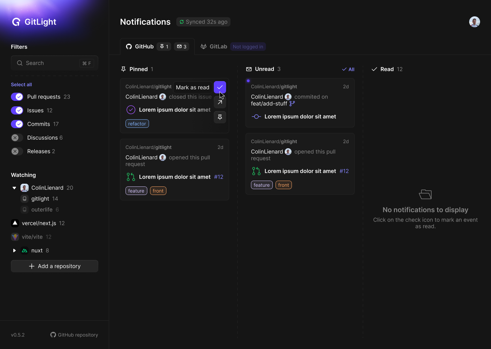

<div align="center">


# [GitLight](https://gitlight.vercel.app)

GitHub & GitLab notifications on your desktop

 

</div>



---

## About

Better GitHub notifications and ~~GitLab push notifications~~ (not yet). Available on **MacOS**, **Windows**, **Linux** and in the **browser**. Free and open-source.

> **Warning**: GitLight is currently in development so bugs may be present

## Features

- Get push notifications
- Monitor notifications with efficiency thanks to a kanban style interface
- Filter by repository, organization, pull request, issues, commits...
- Get precise notification data
- And more...

## Tech Stack

- **UI** → [Svelte](https://svelte.dev/)
- **Framework** → [SvelteKit](https://kit.svelte.dev/)
- **Langage** → [Typescript](https://www.typescriptlang.org/)
- **Desktop app** → [Tauri](https://tauri.app/)
- **Deployment** → [Vercel](https://vercel.com)
- **Package manager** → [pnpm](https://pnpm.io/)

## Running locally

### Desktop app

> **Note**: Skip this if you don't want to work on the native app

Just follow the [Tauri prerequisites](https://tauri.app/v1/guides/getting-started/prerequisites).

### GitHub OAuth app

The app needs to authenticate the user to GitHub, so we need to create a new OAuth GitHub application [here](https://github.com/settings/applications/new). Fill the fields and set the **Authorization callback url** to `http://localhost:5173/auth/callback`.

Also create a unique 32 characters code here: https://generate-secret.vercel.app/32

Then, create a `.env` file at the root of the project:

```.env
AUTH_GITHUB_ID={your client ID}
AUTH_GITHUB_SECRET={your client secret}
AUTH_SECRET={your 32 characters code}
```

### Frontend

Just install dependencies:

```bash
pnpm install
```

### Running the project

|                      | With Tauri         | In the browser |
| -------------------- | ------------------ | -------------- |
| Start the dev server | `pnpm tauri dev`   | `pnpm dev`     |
| Build the app        | `pnpm build:tauri` | `pnpm build`   |

## License

[MIT](./LICENSE) © Colin Lienard
