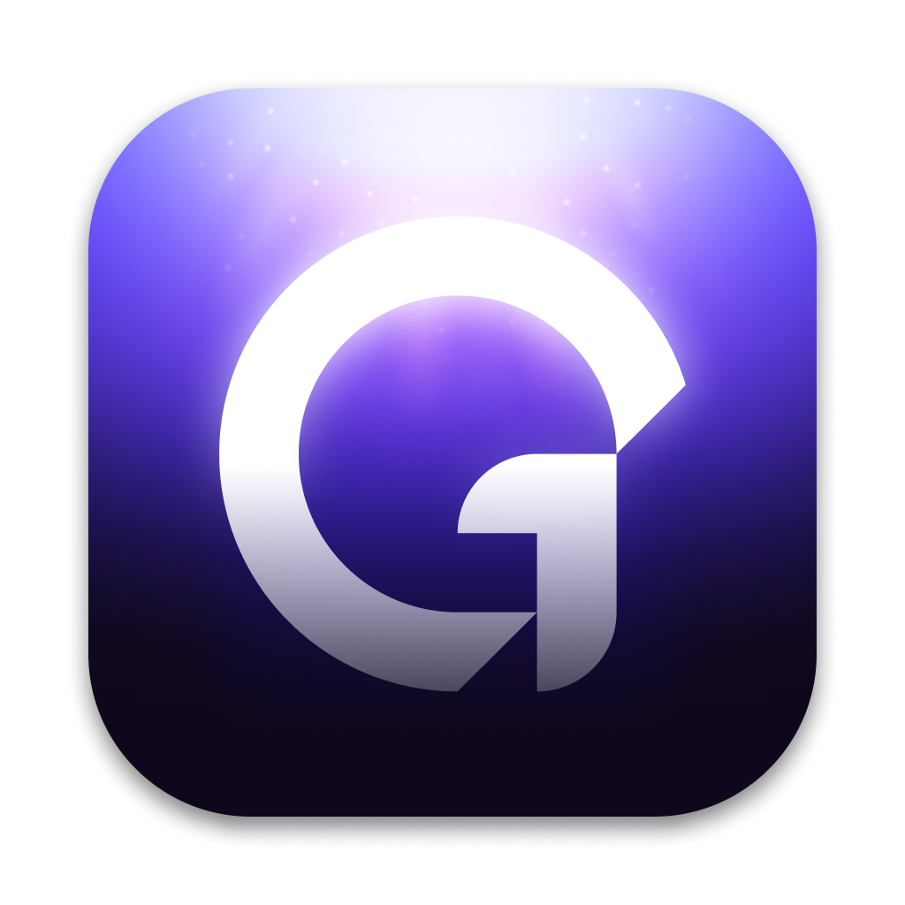

# [GitLight](https://gitlight.app)

GitHub & GitLab notifications on your desktop

---

## About

Better GitHub notifications and ~~GitLab push notifications~~ (not yet). Available on **MacOS**, **Windows**, **Linux** and in the **browser**. Free and open-source.

> **Warning**: GitLight is currently in development so bugs may be present

## Features

- Get push notifications
- Monitor notifications with efficiency thanks to a kanban style interface
- Filter by repository, organization, pull request, issues, commits...
- Get precise notification data
- And more...

## Contributing

[How to contribute](./CONTRIBUTING.md)

## License

[MIT](./LICENSE) © Colin Lienard
